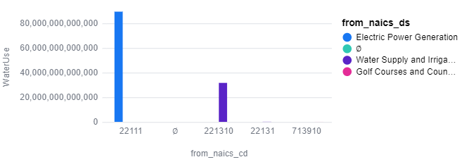
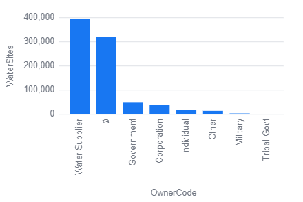
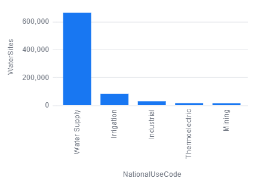
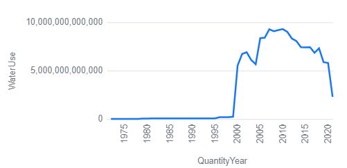
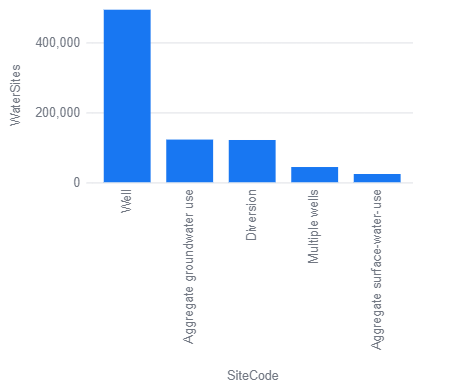

# Data Liberation Project: Water Use Inventory Analysis
## Description:
This project analyzes site-level data from the U.S. Geological Survey's (USGS) water use inventory records. Data includes annual volumes and water types conveyed between sites through 2021. This data was obtained through a Freedom of Information Act (FOIA) request. Data files contain water records for all 50 states with the exception of New Jersey, combining for a total of 823,552 entries. Each entry represents a measured or estimated volume of water transferred between two sites in a given year. Data is severely limited due to FOIA reporting exemptions, and many records are missing or duplicated. However, this data is the first publicly available release of national site-level water conveyance information. More information about this data may be found on the Data Liberation Project website found here: https://www.data-liberation-project.org/
## Importance:
This dataset helps to inform politicians, water agencies, and researchers understand how water is distributed across different regions within the United States, which in effect may help with water conservation management. Water-use information should be transparent to the public and should hold government agencies and businesses accountable for their water consumption levels. Additionally, water-use information may help to expose deficiences in water related infrastructure. Water records also help to account for our nation's environmental impact with regards to water consumption trends over time, and may inform us on how to use water in a more sustainable fashion. Furthermore, these records may help to inform organizations about how their water infrastructure (pipelines, reservoirs, and water treatment facilities) could be improved. Water-use inventory analysis helps to identify which areas of the country need the most attention when it comes to drought and conservation attention, and may identify key risks associated with each region. This data also provides valuable insights on which types of industries rely on water-consumption the most, which further helps to showcase how water-use is integrated into different aspects of our economy. Finally, this information may be extremely useful for helping scientists to learn how to improve and facilitate hydrological studies, climate change assessments, and water-use regulation. 
## Data Cleaning Process:
The raw data files included in this dataset contained an immense amount of missing or null values. These values were not cleaned for the purpose of showcasing how incomplete and inaccurate this dataset is. Dictionary and metadata tables were joined together with the main dataset ("records-combined") to allow for a more complete analysis with regards to agency codes, irrigation methods, measurement methods, national water use codes, primary water-use classifications, primary site-use classifications, salinity codes, site owner codes, site types, and topographic codes. Primary keys shared between the data dictionaries and the main dataset were used to join each dataset together. Columns within metadata tables were renamed to reflect the same titles within the main dataset. Important dates were changed using Duckdb functions to allow for query usability in addition to changes in the data types of key columns. 
## Findings:
The ultimate conclusion I've reached after performing this analysis is that the data is severely unreliable and incomplete. Results are not comprehensive, as certain states reported far more effectively than others. With that being said, the results of my analysis are listed below:
- Illinois uses the most water out of all states (Query 17)
- Electric power generation uses more water than all other NAICS code classifications (Query 1)
- The vast majority of water sites are classified as surface water (Query 12)
- Arkansas has the most water sites (Query 14)
- Oklahoma has the most aquifers (Query 15)
- Alabama, Illinois, Louisiana, Minnesota, Missouri, Nevada, Pennsylvania, and South Dakota have the least accurate data (Query 19)
- Idaho, Kansas, Maine, Montana, Oregon, Wisconsin, and Wyoming have the most accurate data (Query 20)
- Water withdrawal is the most common water site use (Query 21)
- Louisiana has the deepest water site well-depths (Query 22)
- Most water sites are used for water supply (Query 5)
- Most water is transported through pipes (Query 23)
- America consumed more water in 2010 than any year in recent history (Query 7)
- Water levels spiked in the 2010s and are gradually declining (Query 8)
- Alaska uses the least amount of water out of all states (Query 24)
- Water consumption levels are usually the highest in June (Query 25)
- Over 75,000 water sites have been discontinued or are inactive (Query 26)
- Most water sites are located on a flat surface (Query 27)
- Water suppliers own the majority of water sites (Query 3)
- Most water sites are classified as wells (Query 9)
- Water measurement methods are extremely inconsistent between sites (Query 28)
- Arkansas relies on hydroelectricity more than any other state (Query 29)
- Rhode Island treats more waste water than any other state (Query 30)
- Washington uses the most amount of water for domestic purposes (Query 31)
- Pennsylvania uses the most amount of water for industrial purposes (Query 32)
- Rhode Island uses the most amount of water for commercial purposes (Query 33)
- Arkansas uses the most amount of water for irrigational purposes (Query 34)
- Oklahoma uses the most amount of water for livestock purposes (Query 35)
- Illinois depends on thermoelectricity more than any other state (Query 36)
- Pennsylvania uses the most amount of water for mining purposes (Query 37)
- Public supply is the most common type of water use (Query 38)
- Georgia uses the most amount of water for cooling purposes (Query 39)
- Pennsylvania uses the most amount of water for power generation purposes (Query 40)
- Illinois uses the most amount of water for public supply purposes (Query 41)
- Oklahoma uses the most amount of water for recreational purposes (Query 42)
- Pennsylvania uses the most amount of water for golf course irrigation (Query 43)
- Missouri uses the most amount of water for institutional purposes (Query 44)
- Louisiana uses the most amount of water for fire protection purposes (Query 45)
- The salinity types of most water sites is unspecified, but is likely fresh water (Query 46)
## How to Use:
To perform your own analysis on the water-use data provided, you must download all files linked in this repository and place them into a folder on your computer. The main dataset, "records-combined", is too large to run in GitHub and must be downloaded and unzipped. Download and install Malloy in Visual Studio Code and open the folder containing all the downloaded files. Then, click on the file titled, "water.malloynb", and you are good to go!
## Key Analytical Visualizations:
 
 
 
 
 